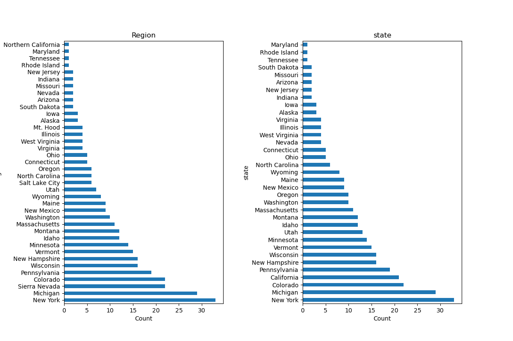
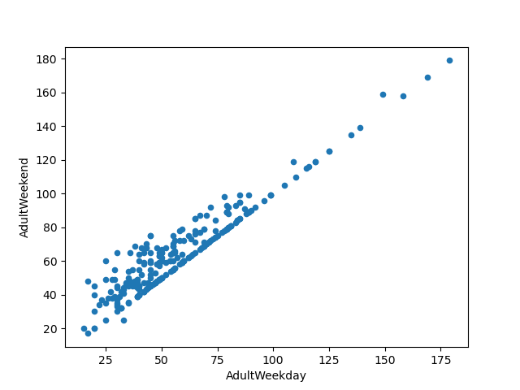
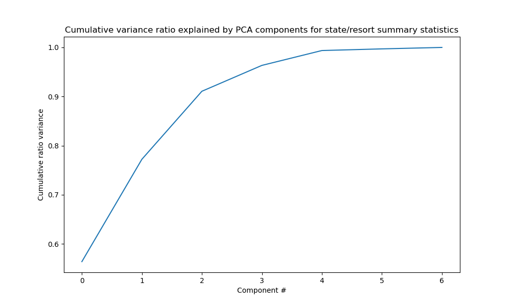
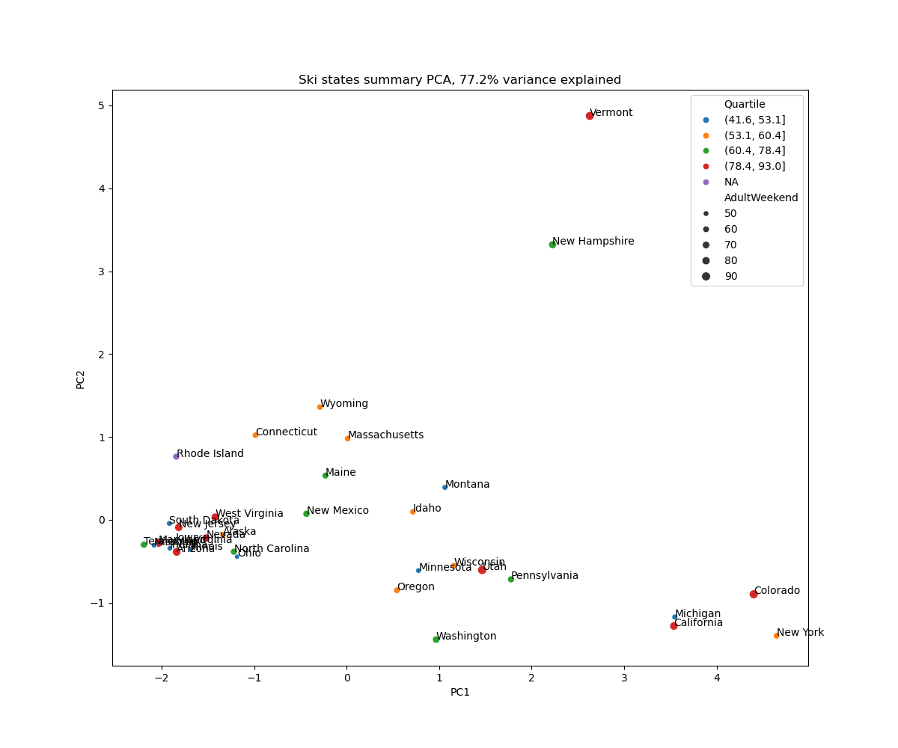
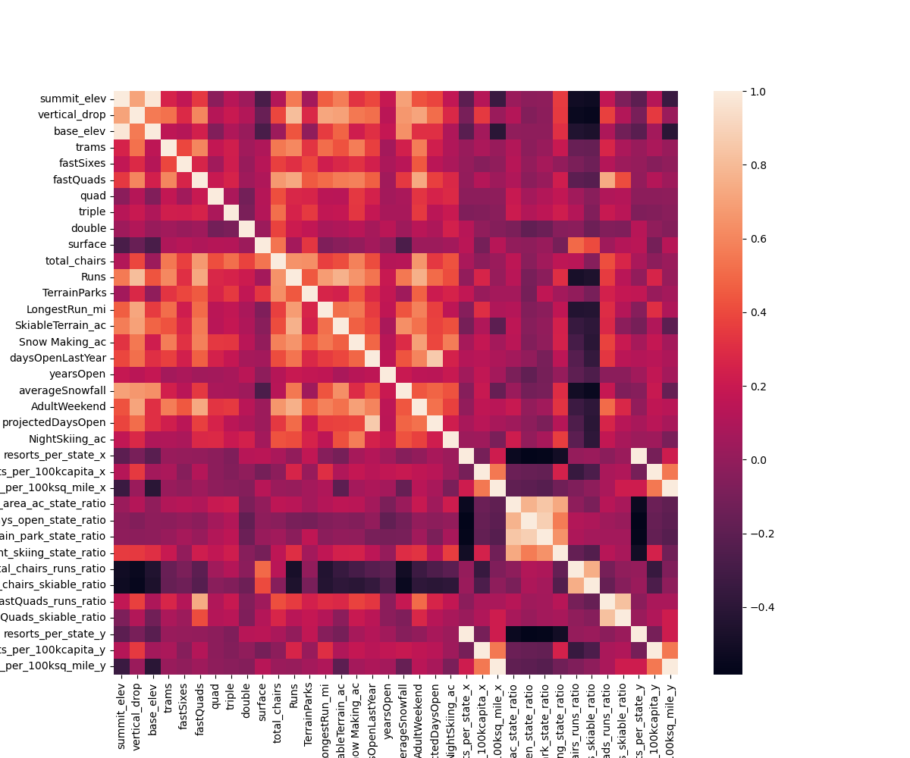
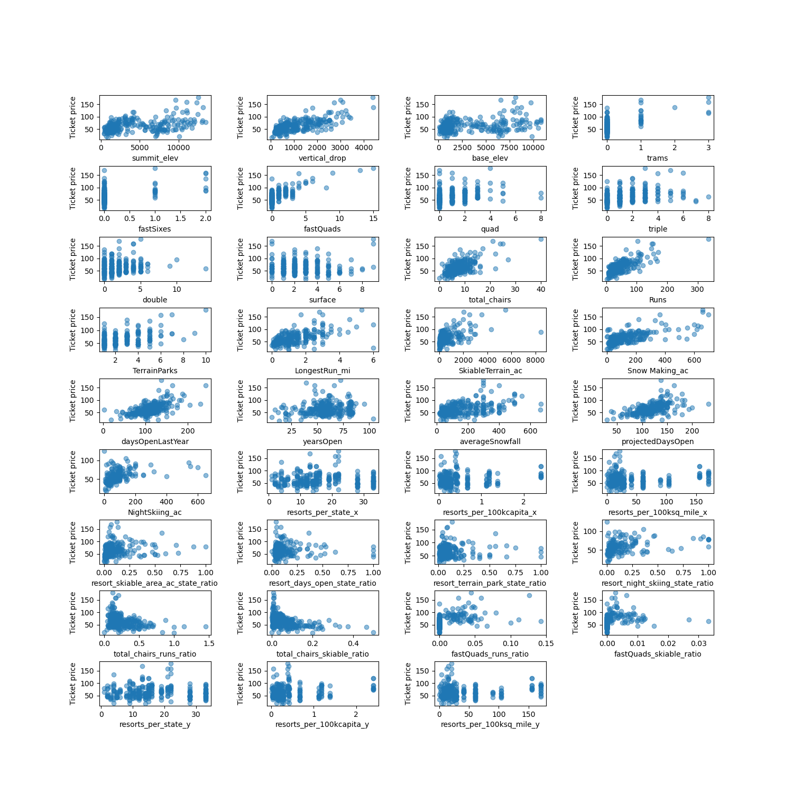
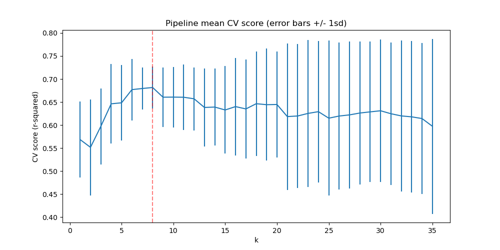
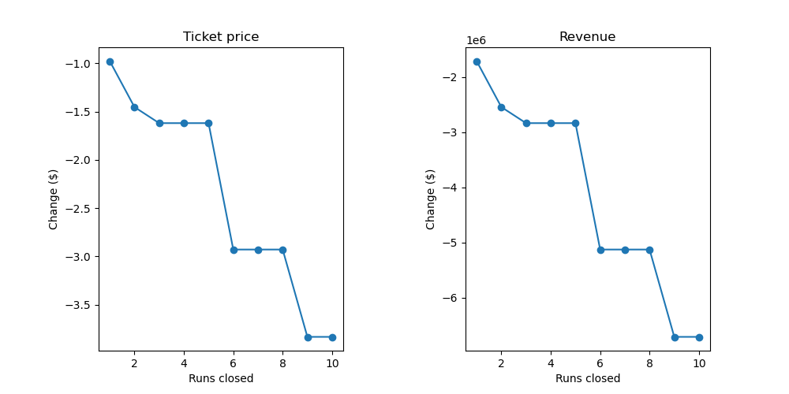

# Ski Resort Pricing Analysis — Final Report

## 1. Problem Statement
Big Mountain Resort wants to optimize its ticket pricing by understanding the value of its facilities and identifying cost changes that do not negatively impact price. Currently, prices are largely based on market averages rather than facility-specific value. Using data from other resorts and Big Mountain’s own features, we aim to quantify which operational and facility attributes most influence ticket pricing. The goal is to provide actionable insights to set an optimal ticket price and guide cost-efficient decisions before the next ski season using statistical and data science methods. 

## 2. Data Wrangling
The raw dataset contained inconsistent pricing fields, missing values, and categorical variables that required attention. Key steps included:
- Removed resorts with missing pricing information to ensure reliable modeling.
- Created regional and state-level summaries to understand the distribution of resorts geographically.
- Visualized basic distributions for all numeric features to identify outliers and potential data issues.
- Merged demographic data with resort attributes (e.g., state population and area) to provide context for later ratio calculations.
- Determined that adult weekend price was the more appropriate target for modeling, based on its stronger consistency and correlation with resort features.  
  
### Resorts by state and region
  

### Scatter plot of weekday and weekend pricing 

## 3. Exploratory Data Analysis (EDA)
EDA provided insight into geographic patterns, resort characteristics, and price drivers. Key findings:
- PCA of state/resort summary statistics showed that two components explained 77.2% of total variance.
- Correlation analysis identified strong positive associations between price and features such as vertical drop, skiable acreage, and total runs.
- Scatterplots confirmed nonlinear relationships, supporting the use of tree-based models.

### PCA variance ratio 

### PCA 2-component scatter plot 
 

### Correlation heatmap 

### Scatterplots of key features vs price 

## 4. Model Preprocessing & Feature Engineering
To prepare data for modeling:
- Standardized numeric features where required.
- Engineered ratio features (ratio of resort skiable area to total state skiable area, etc.).
- Built a modeling pipeline with scaling, polynomial terms, and feature selection.
- Determined number of features to use and what those features should be.

### Pipeline mean CV score vs feature count

## 5. Algorithms and Evaluation Metrics
Models tested:
- **Linear Regression**
- **Random Forest Regressor**

Evaluation metric:
- **R² score** (primary)
- **MAE** (secondary for interpretability)

Random Forest delivered the best performance with:
- Strong generalization
- High interpretability via feature importance
- Robustness to scaling and missing structure

### Random Forest feature importance bar chart

## 6. Winning Model & Scenario Modeling
The **Random Forest Regressor** was selected as the final model. Feature importance revealed that the strongest price drivers were:
1. Fast quad chairlifts  
2. Number of runs   
3. Snow making  
4. Vertical drop   
5. Skiable terrain 
6. Total number of chairs 
7. Longest run 
8. Trams   

Scenario modeling tested the impact of removing runs (1–10 removed).  
Results:
- Ticket price predictions decline nonlinearly as runs are removed.
- Estimated revenue also decreases, confirming high sensitivity to total run count.

### Ticket price + revenue line chart under run-removal scenarios 

## 7. Pricing Recommendation
For a resort comparable to the Montana test location in the dataset:
- A price in the **$88 - $98 weekend range** is competitive relative to similar resorts.
- Resorts with:
  - Higher terrain acreage,
  - Greater vertical drop,
  - More total runs,
  - More chairlift capacity  
  can justify pricing above this range.

## 8. Conclusion
This project demonstrates that ski resort pricing is strongly explained by physical infrastructure and mountain characteristics. Geographic context plays a secondary but meaningful role. Using machine learning models—especially tree-based algorithms—provides clear, actionable predictions for pricing strategy. The results provide a defensible, data-backed range for weekend ticket prices.

## 9. Future Scope of Work
Future improvements could include:
- Time-series modeling with multi-year pricing data.
- Integrating weather, snowfall variability, and climate trends.
- Incorporating visitor count or demand-side data.
- Building a web dashboard for scenario-based price simulation.
- Additional data on upgrade costs for changes that the model prdicts to increase price. 